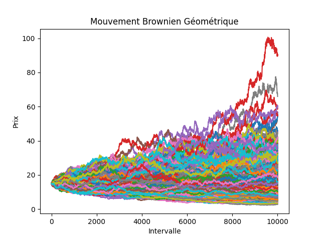

# Consignes
[1] Créer un programme pour déterminer le prix d’une option financière à l'aide de l'équation de Black, Scholes et Merton, puis à l'aide de la simulation de Monte Carlo.

# Structure du code
## Réalisations
Pour répondre à la consigne, nous avons choisi de comparer le pricing par simulation de Monte-Carlo et par la formule de Black-Scholes.
Le pricing a été réalisé en fonction des variables suivantes:    
 - S: prix du sous-jacent à l'instant initial  
 - vol: volatilité du sous-jacent en années, supposée constante  
 - r: taux d'intérêt risque neutre en années, supposé constant  
 - K: strike de l'option  
 - T: date de maturité de l'option en années     

Nous avons réalisé le pricing d'options vanilles européennes à l'aide de ces deux méthodes et avons comparé les résultats.  
Voici les résultats obtenus :  
```
    Prix d'un CALL européen:
    Prix (Monte Carlo): 45.0838
    Prix (Black, Scholes et Merton): 45.3285

    Prix d'un PUT européen:
    Prix (Monte Carlo): 12.1092
    Prix (Black, Scholes et Merton): 12.0468
```

Afin que le code soit plus clair et épuré, nous avons organisé notre code sous forme de fichier header `.h` en utilisant la Programmation Orienté Objet (POO) étudié lors des cours et des TD de C++. [2]

## main.cpp
**main.cpp** importe ainsi les *classes* **MonteCarlo** et **BlackScholes** afin de créer respectivement les instances **my_monte_carlo** et **my_black_scholes**. On trouve alors des valeurs qui ne sont pas égales mais très proches, cela étant dû à l'approche par estimation de la simulation de Monte Carlo.

# Formules Mathématiques
## Monte Carlo [3]
Ayant $\frac{C_t}{B_t} = \mathbb{E}_{\mathbb{Q}}[\frac{C_T}{B_T}\mid F_t]$, on en déduit $\frac{C_0}{B_0} = \mathbb{E}_{\mathbb{Q}}[\frac{C_T}{B_T}\mid F_0]$

Dans le modèle de Black, Scholes et Merton, $$ dS_t = rS_tdt+\sigma S_tdW_t$$ alors, nous pouvons simuler plusieurs trajectoires de prix du sous-jacent et on peut en déduire le payoff de l'option à la maturité pour chacun de ces trajectoires.


- payoff de l'option dans l'itération i de la simulation Monte Carlo $$C_{0,i} = \exp (-\int^{T}_{0}r_s ds) C_{T,i} = \exp (-rT) C_{T,i}$$ car r est constante.

- Ainsi il suffit de calculer la moyenne $$ \hat{C_0} = \frac{1}{M}\sum^{M}_{i=1} C_{0,i}$$ pour approximer le prix de l'option (loi forte des grands nombres).  




## Black Scholes [4]
Supposons que $r$ et $vol$ sont constants, alors nous pouvons obtenir à l'aide du lemme d'Îto le prix d'un call européen selon l'équation: 
 $$C_{0} = S_0 N(d_1) - K\exp (-rT)N(d_2)$$
 où $d_1 = \frac{\ln(\frac{S_0}{K}) + (r + \frac{vol^2}{2})T}{vol\sqrt{T}}$ et $d_2 = d_1 - vol\sqrt{T}$

 et on en déduit le prix d'un put européen à l'aide de la formule de parité call/put:
 $$C_0-P_0 = S_0 - K\exp{(-rT)}$$


# Difficultés rencontrées
## CMake
Pour gérer un projet d'une telle ampleur, nous ne pouvions pas utiliser `gcc` ou `g++` pour compiler les fichiers un par un. Nous avons donc fait appel à CMake :  
[5] *CMake is the de-facto standard for building C++ code, with over 2 million downloads a month. It’s a powerful, comprehensive solution for managing the software build process. Get everything you need to successfully leverage CMake by visiting our resources section.*

## Exécuter le code 

### Calculer le prix de l'option
```
	g++ -o main.exe main.cpp src/MonteCarlo.cpp src/BlackScholes.cpp
	./main.exe
```

### Simulation de Monte Carlo
Beaucoup de difficultés ont été rencontré lors de la création du plot, notamment du fait que C++ n'a pas ces fonctionnalités de façon native. Nous avons donc fait appel à des libraries externes et nous avons appris à les utiliser au sein de notre code. La partie la plus complexe est de localiser les différents fichiers sources pour la compilation:   
 - "C:\\Program Files\\Python312\\include" : Path vers le C header source file Python.h  
 - "C:\\Users\\trant\\AppData\\Roaming\\Python\\Python312\\site-packages\\numpy\\core\\include" : Path vers la librairie numpy  
 - "C:\\Program Files\\Python312\\libs" : Path vers les libraries Python  
```
    g++ mainplot.cpp -o mainplot src/MonteCarlo.cpp 
    -I "C:\Program Files\Python312\include" 
    -I "C:\Users\trant\AppData\Roaming\Python\Python312\site-packages\numpy\core\include" 
    -L  "C:\Program Files\Python312\libs" -lpython312
```


## Pour créer ce document
```
    pandoc README.md -o README.pdf  
```


# Bibliographie
 0. Lien github : [https://github.com/tttienthinh/Pricer](https://github.com/tttienthinh/Pricer)
 1. PDF : Projets C++ ENSAE 2023
 2. Course on C++ (3) ENSAE, Roxana Dumitrescu
 3. LEMIEUX Christiane, Monte Carlo and quasi-Monte Carlo sampling, Springer
 4. HULL J. : Options, Futures and Other Derivatives, 6th edition, PRENTICE HALL, 2005.
 5. CMake : [https://cmake.org/](https://cmake.org/)
 6. matplotlib-cpp : [https://github.com/Cryoris/matplotlib-cpp](https://github.com/Cryoris/matplotlib-cpp)